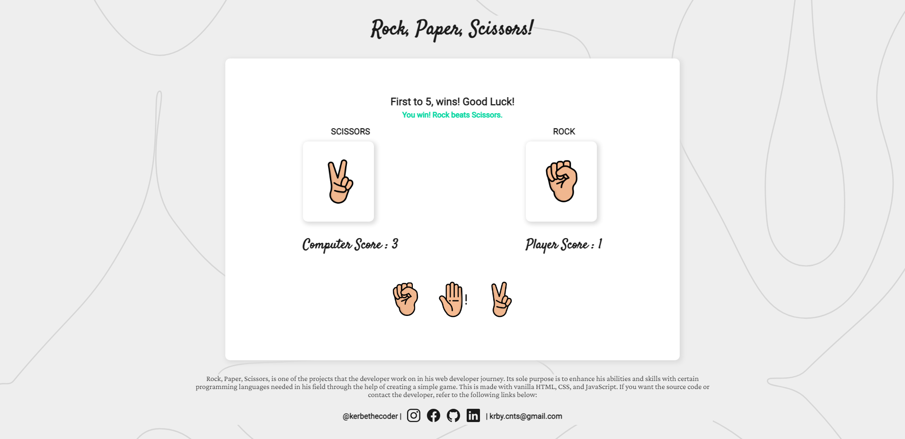

# Rock, Paper, Scissors :video_game:

---

This is a simple Rock, Paper, Scissors game implemented using vanilla JavaScript, HTML, and CSS.



## How to Play

1. Open the `index.html` file in your web browser. //change to link
2. Choose your move by clicking one of the three icons: Rock, Paper, or Scissors.
3. The computer will randomly select its move.
4. The result of the round will be displayed on the screen.
5. Keep playing rounds to see who wins the game. Enjoy!

## Features

- Play Rock, Paper, Scissors against the computer.
- Random computer move selection.
- Keeps track of the score.
- Announces the winner of each round and the overall winner.

## Technologies Used

- HTML
- CSS
- JavaScript

## Folder Structure

- `index.html` - The main HTML file for the game.
- `style.css` - The CSS file for styling the game.
- `index.js` - The JavaScript file for the game logic.

## Want the game?

1. Fork the repository.
2. Clone your forked repository to your local machine:

```bash
git clone https://github.com/kerbethecoder/rock-paper-scissors.git
```

3. Enjoy coding! Oh, and make sure to tag me in there! :smile:

## License

This project is licensed under the MIT License - see the LICENSE file for details.

## Credits

Game icons and images were created by

- <a href="https://www.freepik.com/icon/punch_6142258#fromView=resource_detail&position=9">Icon by photo3idea_studio</a>
- <a href="https://www.freepik.com/icon/victory_6142275#fromView=resource_detail&position=2">Icon by photo3idea_studio</a>
- <a href="https://www.freepik.com/icon/raise-hand_6142099#fromView=resource_detail&position=15">Icon by photo3idea_studio</a>
- <a href="https://www.freepik.com/icons/rock-paper-scissors">Icon by Freepik</a>

I greatly appreciate the talented individuals who contributed their work to make this game possible.

## Author

🚀 [kerbethecoder](https://github.com/kerbethecoder)
📫 krby.cnts@gmail.com
📌 September 10, 2023

Happy coding! :philippines:
